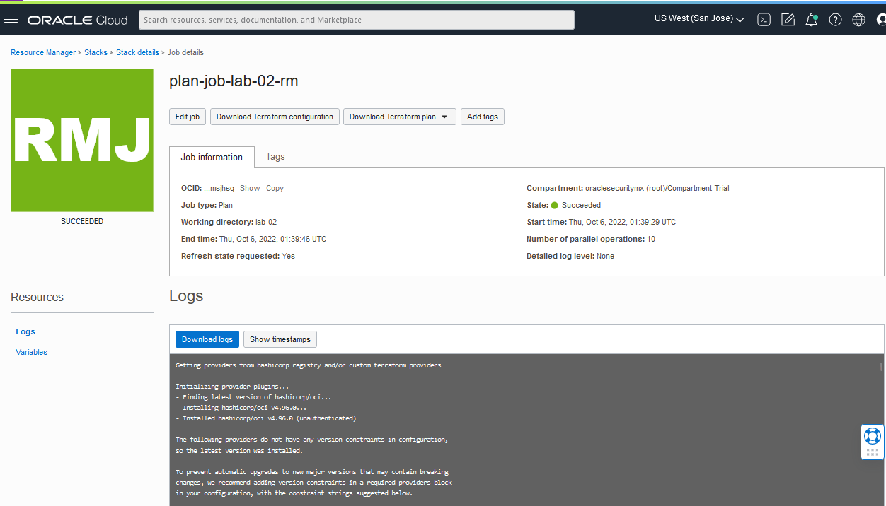

---
# LAB-04 - OCI-INLAB laboratory using VTAP
For this you should consider delete in LAB-01. 
```bash 
$terraform destroy
```
`.[!TIP].
` Esto es un tip

## Architecture LAB-05
The following is a diagram reference from the lab:


## Elements to create:
This lab, will be perform the following objects creation:
1. VCN creation
2. Subnet creation
3. Internet Gateway creation and route table associated
4. Link the routable created with the subnet created
5. 3 instances creation
6. Each instance has a different name, Ex: **webserver-1** & **webserver-2** (for webservers), & **monitor-1** (for monitor traffic mirrored) 
7. Create 3 ingress rules within the security list recently created:
   - TCP 22 port, TCP protocol (SSH Access)
   - TCP 80 port, TCP protocol (Web Server – **DEPLOYED**)
   - TCP 443 port, TCP protocol (Secure Web – **DEPLOYED**)
   - TCP 4879 port, TCP protocol (Mirrored Traffic – **DEPLOYED**)
8. Egress rule creation
   - 0.0.0.0/0 segment (All internet)
9.  1 Load balancer creation to balance 
10. 1 VTAP
11. 2 filters
12. 1 Network Load Balancer

## Run this lab through RM
1. Created a zip file and save it within your local machine:
```bash
$zip -r ~/path-to-your-content/lab-04-rm.zip lab-04/
  
$
```
   
2.  log-in in your OCI Console and go to **hamburguer menu > Developer Services > Resource Manager**:

- Create an stack:


- Select My configuration and **Zip file** option:


- Once you have selected Zip file options, clic on browse and select the file **lab-02.zip** and see the result:

- Keep Custom providers as default, and set the following inputs in each field:
   - Name: lab-04-rm
   - Description: Terraform lab-04-rm
   - Terraform version: 0.13.x


- Clic on Next button

3. You will see automatically is loaded info related with the file **vars.tf** and clic on Next button:


4. In Review phase, just clic create button:


5. The Stack **lab-02-rm** has been created we proceed to create a plan:


- Clic in plan button, and provide the name **plan-job-lab-02-rm** within the text field and clic **Plan** button:


- We can see the **Plan** has been executed successfully:


6. We go to Stack details, clic on **Apply** button, and set the following info:
- Name: apply-job-02-rm
- Apply job plan resolution: **select default plan job listed**
- Once, we clic on blue **Apply** button


7. Once peformed the plan, we can see the progress and the success:


